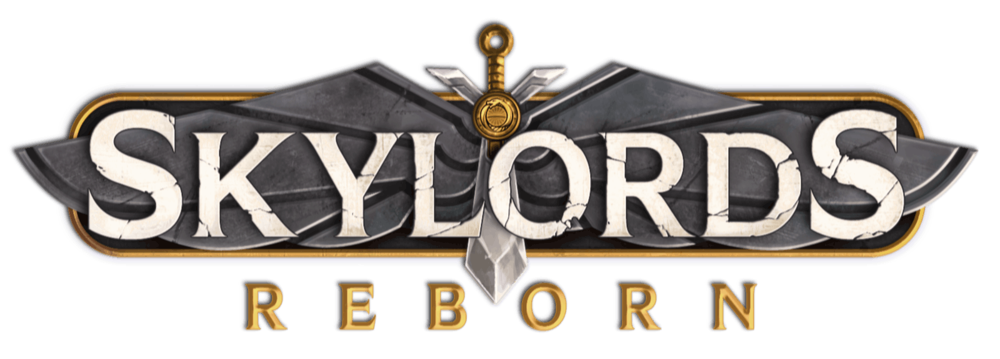
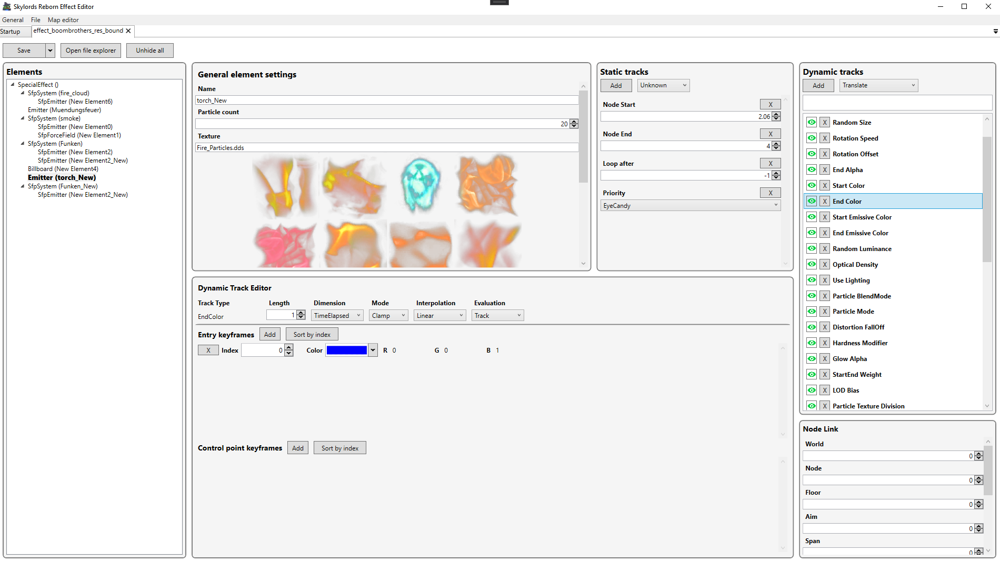
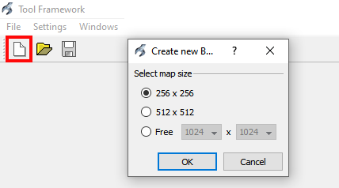
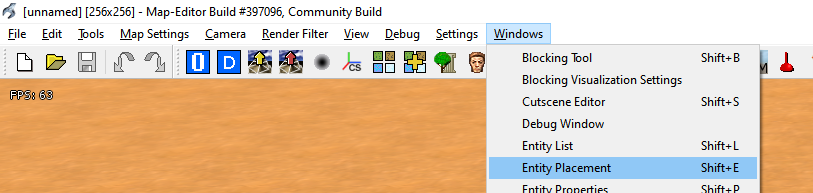
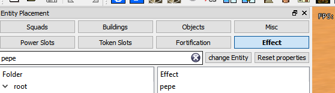

# BattleForge Special Effect Editor
A tool that allows to easily edit the special effect files (`.fxb` extension) of BattleForge. These special effect files are used extensively throughout BattleForge, sometimes more prominently than others. Spells are the easiest example, but units also use special effects in their models. Eruption and Area Ice Shield are examples of two spells. Lost Shade is an example of a unit with a blue flames special effect, similar to Shadow Phoenix but then in purple. All of these and the other 2400+ special effects in BattleForge are editable with this tool.

## Editor screenshot

## Why open source
The reason to open source this editor is because reverse engineering the `.fxb` file type and creating an editor that can display its data is only half the battle to adding new special effect files to Skylords Reborn.  

Although the editor in its current state can modify pretty much every aspect of a special effect file, one must also understand the interaction between different properties to be able to apply meaningful changes to the special effects.  

By open sourcing this editor Skylords Reborn hopes to encourage other developers and players alike to learn and document the inner workings of special effect files and to improve the editor where necessary.  

The ultimate goal is to be able to easily and meaningfully change or combine existing special effects and to create new ones from scratch.

## Getting started
The following steps will allow you to use the special effect editor:
- Download either the source code or the pre-built application. It requires [.NET Framework 4.7.2](https://dotnet.microsoft.com/download/dotnet-framework/net472) to run.
    - Pre-built application: Download the latest release under `Releases` at the top. 
    - Source code: Clone this repository and build the project.
- Download all special effect files and their textures from [the following link](https://drive.google.com/file/d/1pgpBFbs62QpDG1RR3-XqSsHShQLLlSSj/view?usp=sharing). These are the files you will be able to edit with this editor. Extract the content of this `.zip` file into a folder.
- Start the editor and make sure to set the `Resources` folder setting in the startup view to the folder where you stored the files in the previous step. Doing this will allow the editor to also automatically load the images used in special effects in the editor.
- Optionally choose a backup directory in the same settings view. That way a backup is created of every special effect opened.

You should now be able to open and save special effect files.

The map editor is used to visualize changes to special effects. Start the map editor with the `Map Editor` button at the top and select the location of the map editor. This is a file called `pluginbasededitor.exe` in the folder you installed Skylords Reborn.

> **_NOTE:_**  It is important you start the map editor using the `Map Editor` button, instead of manually starting the map editor yourself! Also always make sure you have the latest client files for Skylords Reborn (by running the updater) before editing any special effects with this editor.

Any special effect files that you are working on and want to visualize in the map editor should be placed in a folder named `<skylords_reborn>/bf1/gfx/effects/`, where `<skylords_reborn>` is the folder where you have Skylords Reborn installed. Make sure to give it a unique and recognizable name, different from any of the existing special effect files used in the game already, like `pepe.fxb`.

After having placed a special effect in the aforementioned folder and having started the map editor, create an empty map by clicking on the red highlighted button in the following image and then on `OK`.

Proceed to opening the `Entity Placement` window as shown in the following image.

And lastly select the `Effect` tab in the opened window and search for your special effect. In my case, it is `pepe`. You can then spawn the special effect by clicking on it and clicking anywhere on the map.

> **_NOTE:_**  Always search for your special effect directly by entering the name of it in the search box. Do not try to find your special effect file by navigating the folders in the `Folder` panel: the map editor will not find it that way.

Now, while the special effect editor has `pepe.fxb` open, you can change the special effect and save the file. Clicking the `Save` button will automatically bring up the opened map editor. You can now re-spawn the special effect and immediately see your changes. 

> **_NOTE:_**  Any new files added to the `<skylords_reborn>/bf1/gfx/effects/` folder while the map editor is open will not be shown in the map editor in the `Effect` tab of the `Entity Placement` window. You will be required to close the map editor and re-open it using the `Map Editor` button in the editor.

As an extra, you can also download [SageThumbs](https://sourceforge.net/projects/sagethumbs/). This is an application that allows to easily convert images from `.dds` to `.png` and to directly view `.dds` images in the windows file explorer. 

## How to contribute

### Users
Even without programming experience you can help improve the editor by using it and suggesting improvements, adding documentation about the special effects or reporting bugs. You can do so by writing [issues here](https://gitlab.com/skylords-reborn/battleforge-special-effect-editor/-/issues/new). Please give the issue a short but descriptive title and make sure to choose a suitable issue template if possible. You can choose an issue template in the window where you create a new issue.

### Developers
To contribute to the source code, start by creating a fork of the repository and proceed then to cloning the forked repository locally. Create a short and descriptive branch in your fork, commit and push your changes to that branch and finally create a Merge Request to `develop` from the repository. For more information please read [forking workflow](https://docs.gitlab.com/ee/user/project/repository/forking_workflow.html) and [creating merge requests](https://docs.gitlab.com/ee/user/project/merge_requests/creating_merge_requests.html).

Some extra notes:
- Provide clear and concise titles to your merge requests. A merge request is not obliged to have an issue for now. Choose an appropriate template when creating your merge requests. Description templates can be found in the UI when creating a merge request.
- Have a look around the source code to get a general sense of coding style. We will not be strict on coding styles and prefer to take a pragmatic approach with this editor.
- Adhere to the [MVVM pattern](https://docs.microsoft.com/en-us/archive/msdn-magazine/2009/february/patterns-wpf-apps-with-the-model-view-viewmodel-design-pattern) as much as possible.
- Depending on the number of contributions to this project, this process may be refined in the future.

For any questions, please contact [@Ladadoos](https://forum.skylords.eu/index.php?/profile/2557-ladadoos/).

## Improvements and new features
The following is a list of improvements or new features that could be worked on. This is by no means an exhaustive list.

- Display data differently in the editor after having figured out how changing them affects the special effect. Two possible candidates for this are the dynamic tracks and controlpoints (in bezier mode).
- Document the different properties of a special effect, like the different element types, dynamic tracks and static tracks, and how they interact with each other. This way it is easier to make meaningful changes to special effects (by other people).
    - One idea to show this in the editor could be with tooltips that include GIFs to clearly depict the effect of a change before and after.
- Restrict combinations of elements and/or tracks that create an invalid special effect.  
- Export file to and import from `.xml`. BattleForge can read special effects in the form of `.xml` files too. Having the special effect files in text format also allows to easily version control the special effects.
- Support undo and redo for all editable special effect properties.
- Add dark-mode. 
- The general element settings tries to render its textures if they are present in the specified location. These textures can sometimes be difficult to see if they are white because the background is also white.

## Known issues
- There are 4 tornado special effect files that this editor cannot parse. That is because their datastructure is slightly different and it did not seem worth the time considering the editor can parse all other special effect files (around 2450 of them).

## Contributions
- Created originally by [@Ladadoos](https://forum.skylords.eu/index.php?/profile/2557-ladadoos/)

## License
This project is open source and available under GNU General Public License v3.0. See [LICENSE](./LICENSE) for more information. 